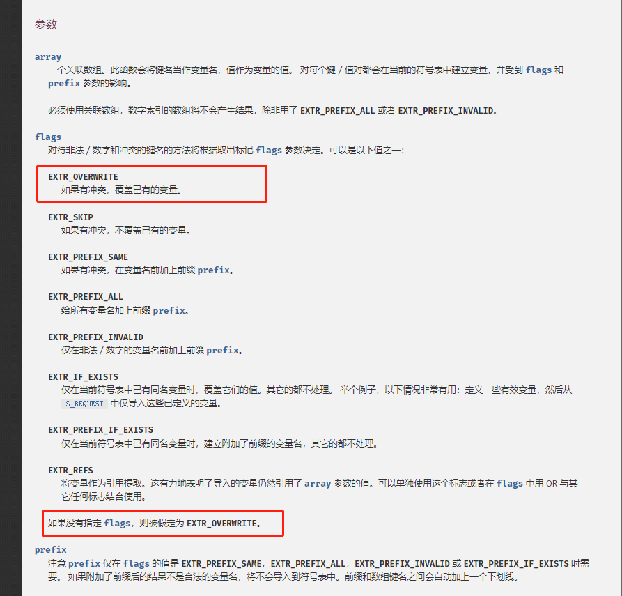
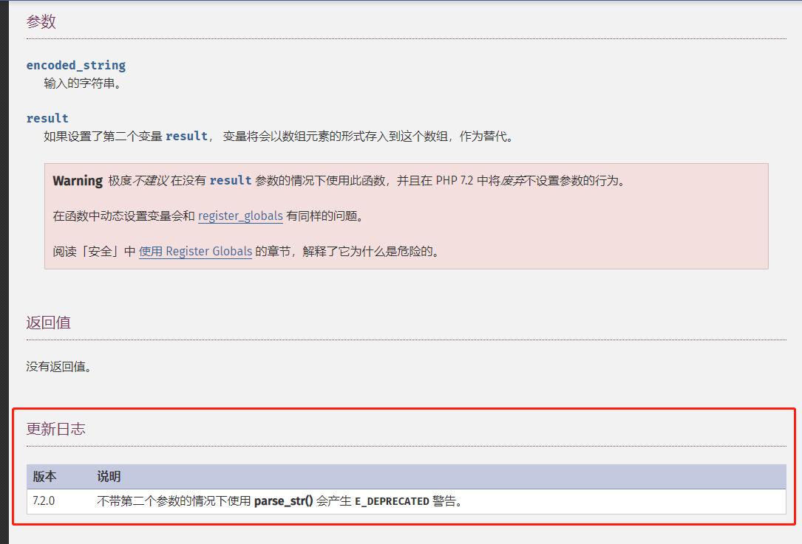

# PHP-bugs
web 安全分析demo

## web 变量覆盖
1. 两个 $ 及 遍历初始化变量时，可能会导致变量被覆盖（没用过）demo1.php
> 为什么会使用 $$ 循环赋值 我的认为是 http://bug.com/WebCover/demo1.php?pass=123&word=222 
> 这样就可以循环赋值达到 $pass = 123 $word=222 直接赋值的效果，但是没有过滤。 
> 可能如果只是比较的化就不需要过滤吧

**参考**
 - [代码审计|变量覆盖漏洞](https://www.freebuf.com/column/150731.html)
 - [变量覆盖漏洞的分析与总结](https://cloud.tencent.com/developer/article/1515390)
2. 不正确的使用 extract() 函数
# PHP-bugs
web 安全分析demo

## web 变量覆盖
**参考**
 - [代码审计|变量覆盖漏洞](https://www.freebuf.com/column/150731.html)
 - [变量覆盖漏洞的分析与总结](https://cloud.tencent.com/developer/article/1515390)
 - [[web安全] 变量覆盖漏洞](https://blog.csdn.net/hitwangpeng/article/details/45972099)
 - [变量覆盖漏洞](https://www.zybuluo.com/1kbfree/note/1135811)
 - [ctf变量覆盖漏洞](https://www.cnblogs.com/wfzWebSecuity/p/7295705.html)
### 1. 两个 $ 及 遍历初始化变量时，可能会导致变量被覆盖（没用过）demo1.php
> 为什么会使用 $$ 循环赋值 我的认为是 http://bug.com/WebCover/demo1.php?pass=123&word=222 
> 这样就可以循环赋值达到 $pass = 123 $word=222 直接赋值的效果，但是没有过滤。 
> 可能如果只是比较的化就不需要过滤吧

### 2. 不正确的使用 extract() 函数 — (从数组中将变量导入到当前的符号表) 
 - extract 使用方法 默认为覆盖已有变量
    
### 3.不正确使用 parse_str() 函数 - 将字符串解析成多个变量 
 - parse_str 使用方法 
    
### 4. import_request_variables() 函数 — 将 GET／POST／Cookie 变量导入到全局作用域中
- 在(PHP 4 >= 4.1.0, PHP 5 < 5.4.0) 中
### 5. register_globals php.ini 配置（5.4 已废除）
- register_globals=On 传递过来的值会被直接注册为全局变量而直接使用
